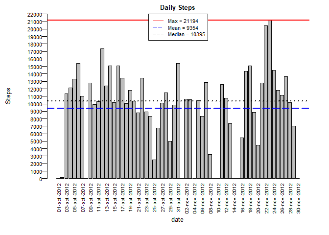
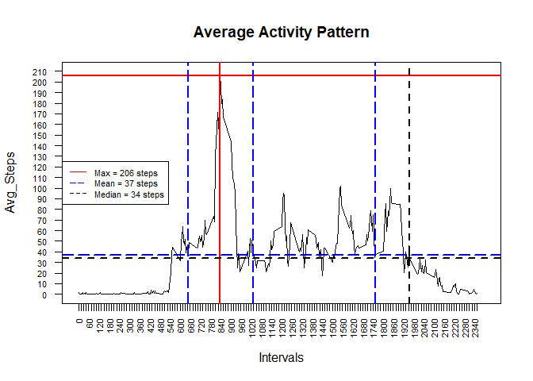
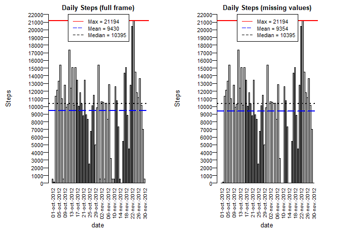
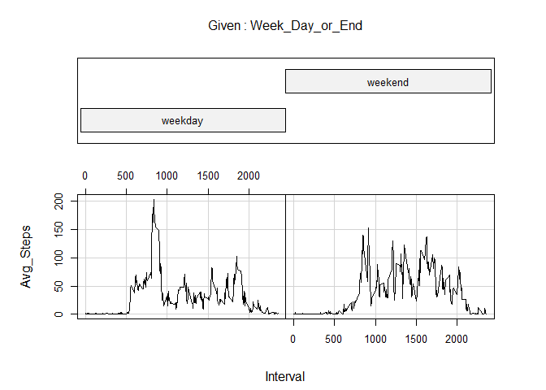

## Loading and preprocessing the data

This is the First Project of the Reproducible Research Course.

Of course, the first step is to show that the data is true, so the download code is worth to include, and for space saving concerns, it's also convenient to delete the zip file, even if it could be done so at the end.


```r
download.file(url = "https://d396qusza40orc.cloudfront.net/repdata%2Fdata%2Factivity.zip",
              destfile = "activity.zip",
              method = "curl")
unzip(zipfile = "activity.zip", exdir = getwd())
#file.remove("project1_data.zip"), this line is blocked in case the whole code has to me run without internet connection, but the zip file is readily available
Raw_Data <- read.csv("activity.csv")
file.remove("activity.csv")
```

```
## [1] TRUE
```


# Answering the Questions

## What is the mean total number of steps taken per day?


For this question, given that there are multiple observations for each day, the data must be AGGREGATED. Though the removal of missing values might be the proper thing to do, in this case, the Raw_Data dataframe will be the one to use for the time being. Nevertheless, as per the instructions, the missing values will be ignored, and to do so, the na.rm = TRUE argument will be used.

Still, formatting the date does seem like a good idea.


```r
Raw_Data$date <- as.Date.character(Raw_Data$date)
str(Raw_Data)
```

```
## 'data.frame':	17568 obs. of  3 variables:
##  $ steps   : int  NA NA NA NA NA NA NA NA NA NA ...
##  $ date    : Date, format: "2012-10-01" "2012-10-01" ...
##  $ interval: int  0 5 10 15 20 25 30 35 40 45 ...
```

```r
summary(Raw_Data)
```

```
##      steps             date               interval     
##  Min.   :  0.00   Min.   :2012-10-01   Min.   :   0.0  
##  1st Qu.:  0.00   1st Qu.:2012-10-16   1st Qu.: 588.8  
##  Median :  0.00   Median :2012-10-31   Median :1177.5  
##  Mean   : 37.38   Mean   :2012-10-31   Mean   :1177.5  
##  3rd Qu.: 12.00   3rd Qu.:2012-11-15   3rd Qu.:1766.2  
##  Max.   :806.00   Max.   :2012-11-30   Max.   :2355.0  
##  NA's   :2304
```


Now an aggregated dataframe must be created, which will be called Daily_Summary.


```r
Daily_Summary <- aggregate(list(Steps = Raw_Data$steps), by = list(date = Raw_Data$date), FUN = function(x) sum(x, na.rm = TRUE))
str(Daily_Summary)
```

```
## 'data.frame':	61 obs. of  2 variables:
##  $ date : Date, format: "2012-10-01" "2012-10-02" ...
##  $ Steps: int  0 126 11352 12116 13294 15420 11015 0 12811 9900 ...
```

```r
summary(Daily_Summary)
```

```
##       date                Steps      
##  Min.   :2012-10-01   Min.   :    0  
##  1st Qu.:2012-10-16   1st Qu.: 6778  
##  Median :2012-10-31   Median :10395  
##  Mean   :2012-10-31   Mean   : 9354  
##  3rd Qu.:2012-11-15   3rd Qu.:12811  
##  Max.   :2012-11-30   Max.   :21194
```


And with a summarized dataframe, the plot that answers the question can be generated.


```r
par(mar = c(6, 5, 1.5, 2.1), mgp = c(3.75, 0.5, 0))

barplot(height = Daily_Summary$Steps, names = format(as.Date(Daily_Summary$date), "%d-%b-%Y"), main = "Daily Steps", cex.main = 0.8, ylab = "Steps", xlab = "date", cex.axis = 0.7, cex.lab = 0.8, cex.names = 0.6, las = 2, ylim = c(0, 22000), yaxt = "n")

axis(side = 2, seq(0, 22000, 1000), las = 1, cex.axis = 0.7)

abline(h = round(max(Daily_Summary$Steps), digits = 0), col = "red", lty = 1, lwd = 2)

abline(h = round(mean(Daily_Summary$Steps), digits = 0), col = "blue", lty = 5, lwd = 2)

abline(h = median(Daily_Summary$Steps), col = "black", lty = 3, lwd = 2)

legend("top", c(paste("Max = ", round(max(Daily_Summary$Steps), digits = 0), sep = ""), paste("Mean = ", round(mean(Daily_Summary$Steps), digits = 0), sep = ""), paste("Median = ", round(median(Daily_Summary$Steps), digits = 0), sep = "")), lty = c(1, 5, 2), lwd = 1, cex = 0.7, col = c("red", "blue", "black"))
```

<!-- -->

It was deemed convenient to place the x-axis values vertically and in a d-b-Y format to better grasp the data.

However, many might ask themselves, why did you not make a histogram? Well, the histogram pretty much count the times an observation's value is repeated, or, in other words, "how many times X steps have been taken in a single observation?". So, in order to count the steps taken each day, a plot that relates both variables, date and total steps taken in said day, is better. Though a line plot might have also worked out, a barplot is better.

## What is the average daily activity pattern?

To answer this question, the reader must understand that, even though the intervals are factors/numbers/integers, in fact, this variable is more of a qualitative one, representing the observations themselves.

As such, what this question does is compare the intervals with one another. And so, a new aggregation is done, this time with the mean function.


```r
Intervals_Average <- aggregate(list(Avg_Steps = Raw_Data$steps), by = list(Interval = Raw_Data$interval), FUN = function(x) mean(x, na.rm = TRUE))
str(Intervals_Average)
```

```
## 'data.frame':	288 obs. of  2 variables:
##  $ Interval : int  0 5 10 15 20 25 30 35 40 45 ...
##  $ Avg_Steps: num  1.717 0.3396 0.1321 0.1509 0.0755 ...
```

```r
summary(Intervals_Average)
```

```
##     Interval        Avg_Steps      
##  Min.   :   0.0   Min.   :  0.000  
##  1st Qu.: 588.8   1st Qu.:  2.486  
##  Median :1177.5   Median : 34.113  
##  Mean   :1177.5   Mean   : 37.383  
##  3rd Qu.:1766.2   3rd Qu.: 52.835  
##  Max.   :2355.0   Max.   :206.170
```


After aggregating the data, it can be visualized

```r
plot(Intervals_Average$Interval, Intervals_Average$Avg_Steps, type = "l", main = "Average Activity Pattern", ylab = "Avg_Steps", xlab = "Intervals", cex.axis = 0.7, xaxt = "n", yaxt = "n", xlim = c(0, 2400), ylim = c(0, 210))

axis(side = 1, seq(0, 2355, 15), las = 2, cex.axis = 0.7)
axis(side = 2, seq(0, 210, 10), las = 2, cex.axis = 0.7)

abline(h = round(max(Intervals_Average$Avg_Steps), digits = 0), col = "red", lty = 1, lwd = 2)

abline(v = Intervals_Average$Interval[round(Intervals_Average$Avg_Steps, digits = 0) == round(max(Intervals_Average$Avg_Steps), digits = 0)], col = "red", lty = 1, lwd = 2)

abline(h = round(mean(Intervals_Average$Avg_Steps), digits = 0), col = "blue", lty = 5, lwd = 2)

abline(v = Intervals_Average$Interval[round(Intervals_Average$Avg_Steps, digits = 0) == round(mean(Intervals_Average$Avg_Steps), digits = 0)], col = "blue", lty = 5, lwd = 2)

abline(h = round(median(Intervals_Average$Avg_Steps), digits = 0), col = "black", lty = 2, lwd = 2)

abline(v = Intervals_Average$Interval[round(Intervals_Average$Avg_Steps, digits = 0) == round(median(Intervals_Average$Avg_Steps), digits = 0)], col = "black", lty = 2, lwd = 2)

legend("left", c(paste("Max = ", round(max(Intervals_Average$Avg_Steps), digits = 0), " steps", sep = ""), paste("Mean = ", round(mean(Intervals_Average$Avg_Steps), digits = 0), " steps", sep = ""), paste("Median = ", round(median(Intervals_Average$Avg_Steps), digits = 0), " steps", sep = "")), lty = c(1, 5, 2), lwd = 1, cex = 0.7, col = c("red", "blue", "black"))
```

<!-- -->

So, on an average day:


```r
paste("(1) The maximum number of steps, ", round(max(Intervals_Average$Avg_Steps), digits = 0), " steps, are taken during the ", Intervals_Average$Interval[round(Intervals_Average$Avg_Steps, digits = 0) == round(max(Intervals_Average$Avg_Steps), digits = 0)], "th interval", sep = "")
```

```
## [1] "(1) The maximum number of steps, 206 steps, are taken during the 835th interval"
```

```r
median_intervals <- as.vector(Intervals_Average$Interval[round(Intervals_Average$Avg_Steps, digits = 0) == round(mean(Intervals_Average$Avg_Steps), digits = 0)])

paste("(2) The average number of steps, ", round(mean(Intervals_Average$Avg_Steps), digits = 0), " steps, are taken during the ", median_intervals[1], "th, ", median_intervals[2], "th, and ", median_intervals[3], "th intervals", sep = "")
```

```
## [1] "(2) The average number of steps, 37 steps, are taken during the 650th, 1035th, and 1755th intervals"
```

```r
paste("(3) The median number of steps, ", round(median(Intervals_Average$Avg_Steps), digits = 0), " steps, are taken during the ", Intervals_Average$Interval[round(Intervals_Average$Avg_Steps, digits = 0) == round(median(Intervals_Average$Avg_Steps), digits = 0)], "th interval", sep = "")
```

```
## [1] "(3) The median number of steps, 34 steps, are taken during the 1955th interval"
```

Of course, the summary of the dataframe reveals that the actual max, mean and median are not integers, so the highlighted intervals are the result of rounding the values. It is expected that the Max value has a corresponding interval, but the same is unlikely to be said about the mean or any quantiles. Also, even if one wants to force an interval for the these values by rounding the data, the method for rounding (approximating, rounding-up, truncating) could give different intervals.

Therefore:


```r
paste("(1) The average maximum number of steps, ", max(Intervals_Average$Avg_Steps), " steps, are taken during the ", Intervals_Average$Interval[which.max(Intervals_Average$Avg_Steps)], "th interval", sep = "")
```

```
## [1] "(1) The average maximum number of steps, 206.169811320755 steps, are taken during the 835th interval"
```

## Inputting missing values

As the summary given at the beginning of this document show, the missing values in the data amount to:


```r
paste(sum(is.na(Raw_Data$steps)), " which represents ", round(100*(sum(is.na(Raw_Data$steps))/nrow(Raw_Data)), digits = 2), "% of the observations remaining", sep = "")
```

```
## [1] "2304 which represents 13.11% of the observations remaining"
```

As the instructions indicate, the missing values must be filled. Luckily, from the previous step, the average of each interval has already been calculated. All that is left is to round said numbers (for consistency sake), and replace the NAs with them. Of course, a new dataframe must be created, which at first, will only be a copy of the original data.

Afterwards, this to be Filled_Dataframe's steps column will be checked for NAs, and whenever one is found, the corresponding interval will be matched with the intervals within the Intervals_Average dataframe, and the NA will be replaced by the rounded average.


```r
Filled_Dataframe <- Raw_Data
Filled_Dataframe$date <- as.Date.character(Filled_Dataframe$date)

for (i in 1:length(Filled_Dataframe$steps)) {
  if(is.na(Filled_Dataframe$steps[i])) {
    Filled_Dataframe$steps[i] <- round(Intervals_Average$Avg_Steps[match(Filled_Dataframe$interval, Intervals_Average$Interval)], digits = 0)
  }
}
str(Filled_Dataframe)
```

```
## 'data.frame':	17568 obs. of  3 variables:
##  $ steps   : num  2 2 2 2 2 2 2 2 2 2 ...
##  $ date    : Date, format: "2012-10-01" "2012-10-01" ...
##  $ interval: int  0 5 10 15 20 25 30 35 40 45 ...
```

```r
summary(Filled_Dataframe)
```

```
##      steps             date               interval     
##  Min.   :  0.00   Min.   :2012-10-01   Min.   :   0.0  
##  1st Qu.:  0.00   1st Qu.:2012-10-16   1st Qu.: 588.8  
##  Median :  0.00   Median :2012-10-31   Median :1177.5  
##  Mean   : 32.74   Mean   :2012-10-31   Mean   :1177.5  
##  3rd Qu.:  2.00   3rd Qu.:2012-11-15   3rd Qu.:1766.2  
##  Max.   :806.00   Max.   :2012-11-30   Max.   :2355.0
```

Now that the Dataframe has been created, we can proceed to REPEAT question 1, applied on the new frame.

First, new aggregated dataframe is created:


```r
Filled_Summary <- aggregate(list(Steps = Filled_Dataframe$steps), by = list(date = Filled_Dataframe$date), FUN = function(x) sum(x, na.rm = TRUE))
str(Filled_Summary)
```

```
## 'data.frame':	61 obs. of  2 variables:
##  $ date : Date, format: "2012-10-01" "2012-10-02" ...
##  $ Steps: num  576 126 11352 12116 13294 ...
```

```r
summary(Filled_Summary)
```

```
##       date                Steps      
##  Min.   :2012-10-01   Min.   :   41  
##  1st Qu.:2012-10-16   1st Qu.: 6778  
##  Median :2012-10-31   Median :10395  
##  Mean   :2012-10-31   Mean   : 9430  
##  3rd Qu.:2012-11-15   3rd Qu.:12811  
##  Max.   :2012-11-30   Max.   :21194
```

And the new "histogram" is plotted. But in this case, the summaries of both the filled frame and the missing values frame are plotted.

<!-- -->

From the plots, the mean has gone slightly up, but for argument's sake, the values will be compared without rounding


```r
paste("The Max, Average and Median steps taken amount to (1) ", max(Daily_Summary$Steps), ", ", mean(Daily_Summary$Steps), " and ", median(Daily_Summary$Steps), " when there are missing values, whereas they become (2) ", max(Filled_Summary$Steps), ", ", mean(Filled_Summary$Steps), " and ", median(Filled_Summary$Steps), " when said NAs are replaced by the average across intervals", sep = "")
```

```
## [1] "The Max, Average and Median steps taken amount to (1) 21194, 9354.22950819672 and 10395 when there are missing values, whereas they become (2) 21194, 9429.77049180328 and 10395 when said NAs are replaced by the average across intervals"
```

So, replacing the missing values with the average of the corresponding interval increases the mean, though the median remains the same.

Whether the 13% of data "missing" is a big chunk or not, it could be inferred that most of the missing values could be found on the latter half of the timeframe; From the second plot, one can notice, from the spike that is the max, that most of the data is located before half of the day has gone by. And from the third plot, one can see that the "new values" have filled the blanks found in the latter half of the timeframe. SO, IT MAKES SENSE THAT THE MEDIAN REMAINS THE SAME.

## Are there differences in activity patterns between weekdays and weekends?

In this case, a final dataframe should be created, one that indicates the day of the week, ideally in numbers, to differentiate saturday and sunday (6, 7) from the rest. Of course, the data used is the one without missing values.


```r
Full_Dataframe <- Filled_Dataframe
Full_Dataframe$weekday <- as.numeric(strftime(as.Date(Full_Dataframe$date, "%d-%b-%Y"), "%u"))
Full_Dataframe$day_or_end <- "weekday"


for (i in 1:length(Full_Dataframe$day_or_end)) {
  if(Full_Dataframe$weekday[i] == 6 | Full_Dataframe$weekday[i] == 7) {
    Full_Dataframe$day_or_end[i] <- "weekend"
  }
}
str(Full_Dataframe)
```

```
## 'data.frame':	17568 obs. of  5 variables:
##  $ steps     : num  2 2 2 2 2 2 2 2 2 2 ...
##  $ date      : Date, format: "2012-10-01" "2012-10-01" ...
##  $ interval  : int  0 5 10 15 20 25 30 35 40 45 ...
##  $ weekday   : num  1 1 1 1 1 1 1 1 1 1 ...
##  $ day_or_end: chr  "weekday" "weekday" "weekday" "weekday" ...
```

```r
summary(Full_Dataframe)
```

```
##      steps             date               interval         weekday     
##  Min.   :  0.00   Min.   :2012-10-01   Min.   :   0.0   Min.   :1.000  
##  1st Qu.:  0.00   1st Qu.:2012-10-16   1st Qu.: 588.8   1st Qu.:2.000  
##  Median :  0.00   Median :2012-10-31   Median :1177.5   Median :4.000  
##  Mean   : 32.74   Mean   :2012-10-31   Mean   :1177.5   Mean   :3.918  
##  3rd Qu.:  2.00   3rd Qu.:2012-11-15   3rd Qu.:1766.2   3rd Qu.:6.000  
##  Max.   :806.00   Max.   :2012-11-30   Max.   :2355.0   Max.   :7.000  
##   day_or_end       
##  Length:17568      
##  Class :character  
##  Mode  :character  
##                    
##                    
## 
```

Now that the Data has been expanded to indicate whether the observation took place during a weekday or the weekend, it can be aggregated, just as with the 2° question.


```r
Intervals_Average_Full <- aggregate(list(Avg_Steps = Full_Dataframe$steps), by = list(Interval = Full_Dataframe$interval, Week_Day_or_End = Full_Dataframe$day_or_end), FUN = function(x) mean(x, na.rm = TRUE))
str(Intervals_Average_Full)
```

```
## 'data.frame':	576 obs. of  3 variables:
##  $ Interval       : int  0 5 10 15 20 25 30 35 40 45 ...
##  $ Week_Day_or_End: chr  "weekday" "weekday" "weekday" "weekday" ...
##  $ Avg_Steps      : num  2.289 0.667 0.422 0.444 0.356 ...
```

```r
summary(Intervals_Average_Full)
```

```
##     Interval      Week_Day_or_End      Avg_Steps      
##  Min.   :   0.0   Length:576         Min.   :  0.250  
##  1st Qu.: 588.8   Class :character   1st Qu.:  1.873  
##  Median :1177.5   Mode  :character   Median : 23.076  
##  Mean   :1177.5                      Mean   : 34.418  
##  3rd Qu.:1766.2                      3rd Qu.: 54.781  
##  Max.   :2355.0                      Max.   :203.156
```

Now, given that the question is only to compare the pattern between weekdays and the weekend, it is not necessary to include or determine the max values for either "segment". This part could be fulfilled elegantly and aesthetically with ggplot, but for simplicity's sake, coplot was chosen.


```r
coplot(Avg_Steps ~ Interval | Week_Day_or_End, Intervals_Average_Full, show.given = TRUE, type = "l")
```

<!-- -->

Just from the plot comparison, the working days have fewer steps taken at the later three fifths of the day, whereas the weekend seems to be signifantly more leveled, at least in comparison to the weekdays.

Also, the impact of the weekend average steps can't be denied; whereas as a whole the spikes found approximately at the intervals 1200ths, 1600ths and 1800ths go up and then down, those same spikes can be found in the weekdays segment at the same intervals but with a clearer rising tendency.

#### With this, all questions should have been answered. 

Although ggplot might have worked better in some regard, specially for the last 2 questions, it proved to be difficult to work with when it came to adding the lines that highlighted the max, mean and median values and their intervals.

And so, to finish this assignment, a final chunk of code will be included to delete all objects, and also to copy the figures from the PA1_template_files to the instructions_fig. Unfortunately, I've had some trouble with moving or copy-pasting.


```r
rm(list = ls())

file.copy(from = './PA1_template_files/figure-html/Plot 1-1.png', to = './instructions_fig/Plot 1-1.png')
```

```
## [1] FALSE
```

```r
file.copy(from = './PA1_template_files/figure-html/Plot 2-1.png', to = './instructions_fig/Plot 2-1.png')
```

```
## [1] FALSE
```

```r
file.copy(from = './PA1_template_files/figure-html/Plot 3-1.png', to = './instructions_fig/Plot 3-1.png')
```

```
## [1] FALSE
```

```r
file.copy(from = './PA1_template_files/figure-html/Plot 4-1.png', to = './instructions_fig/Plot 4-1.png')
```

```
## [1] FALSE
```
